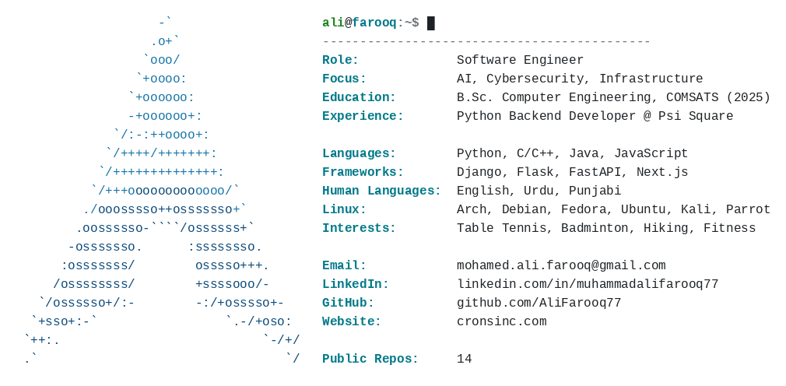

<h1 align="center">Muhammad Ali Farooq</h1>

Software engineer &middot; AI &middot; Cybersecurity &middot; Infrastructure

  

### Featured projects

- **[ML-Based Intrusion Detection System](https://github.com/AliFarooq77/FYP)**: Classifies live network traffic as benign, DoS, or port scan using a custom dataset and Random Forest/XGBoost models.
- **[dockerized-full-stack-webapp](https://github.com/AliFarooq77/dockerized-full-stack-webapp)**: Laravel, React, and MySQL app, containerized with Docker Compose and a Jenkins CI/CD pipeline.
- **[task-manager-react-flask](https://github.com/AliFarooq77/task-manager-react-flask)**: Full-stack task manager with a Flask REST API and a React frontend.
- **[aqi-model](https://huggingface.co/alifarooq77/aqi-model)**: Gemma-2B fine-tuned with LoRA for air-quality-focused chat.

More projects and write-ups at [cronsinc.com](https://www.cronsinc.com). Also on [LinkedIn](https://www.linkedin.com/in/muhammadalifarooq77).
